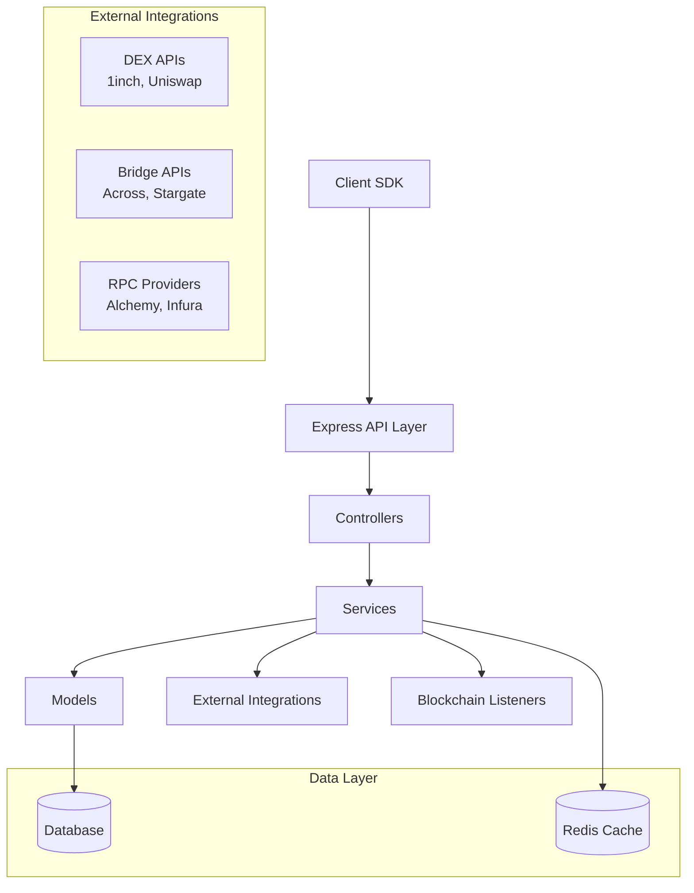

# Design Document

## Overview

The Griffin Orchestrator is a TypeScript-based Express.js server that serves as the core backend component for cross-chain payment orchestration. It implements an intent-based architecture where users express payment intentions through client SDKs, and the orchestrator handles the complex execution across multiple blockchain networks, DEXs, and bridge protocols.

The service follows a modular architecture with clear separation of concerns, utilizing the Route-Service-Model pattern typical of Express.js applications for maintainability and scalability. The orchestrator integrates with external liquidity providers (1inch, Uniswap), bridge protocols (Across, Stargate, Orbiter), and maintains real-time blockchain event monitoring for payment verification.

## Architecture

### High-Level Architecture



### Layered Architecture

The orchestrator follows a 4-layer architecture typical of Express.js applications:

1. **Route Layer**: Express.js routes and middleware for request handling
2. **Service Layer**: Business logic, external integrations, and cross-chain operations  
3. **Model Layer**: Data persistence, validation, and database interactions
4. **Middleware Layer**: Authentication, validation, error handling, and logging

### Monorepo Integration

The orchestrator is structured as a package within the Griffin monorepo:

```
packages/
└── orchestrator/
    ├── src/
    │   ├── routes/
    │   ├── services/
    │   ├── models/
    │   ├── middleware/
    │   ├── types/
    │   ├── utils/
    │   └── app.ts
    ├── tests/
    ├── package.json
    └── tsconfig.json
```

## Components and Interfaces

### Core Components

#### 1. Intent Management System

**IntentController**
- Handles HTTP requests for intent creation and querying
- Validates request parameters and authentication
- Formats responses and error handling

**IntentService**
- Manages intent lifecycle and state transitions
- Coordinates with other services for execution
- Implements business rules and validation logic

**IntentModel**
- Defines intent data structure and persistence
- Handles database operations and queries
- Manages intent status and history tracking

#### 2. Route Discovery Engine

**RouteService**
- Aggregates quotes from multiple DEXs and bridges
- Calculates optimal paths considering costs and time
- Implements route caching and optimization algorithms

**DEXIntegration**
- Abstracts interactions with DEX APIs (1inch, Uniswap)
- Handles quote requests and execution calls
- Manages API rate limiting and error handling

**BridgeIntegration**
- Manages bridge protocol integrations (Across, Stargate, Orbiter)
- Handles cross-chain transfer quotes and execution
- Implements bridge-specific logic and error recovery

#### 3. Payment Verification System

**VerificationService**
- Validates user balances and signatures before execution
- Implements fraud detection and risk assessment
- Coordinates with blockchain providers for balance checks

**EventListener**
- Monitors blockchain events for transaction confirmations
- Implements WebSocket connections for real-time updates
- Handles event parsing and status updates

#### 4. Execution Engine

**ExecutionService**
- Orchestrates cross-chain payment execution
- Implements atomic operations and rollback procedures
- Manages transaction sequencing and dependencies

**TransactionManager**
- Handles blockchain transaction submission and monitoring
- Implements gas estimation and fee management
- Manages transaction retries and error recovery

### External Integrations

#### DEX Integration Architecture

```typescript
interface DEXProvider {
  name: string;
  getQuote(params: SwapQuoteParams): Promise<SwapQuote>;
  executeSwap(params: SwapExecutionParams): Promise<TransactionResult>;
  getSupportedTokens(chainId: number): Promise<Token[]>;
}

interface SwapQuoteParams {
  fromToken: string;
  toToken: string;
  amount: string;
  chainId: number;
  slippageTolerance: number;
}
```

#### Bridge Integration Architecture

```typescript
interface BridgeProvider {
  name: string;
  getQuote(params: BridgeQuoteParams): Promise<BridgeQuote>;
  executeBridge(params: BridgeExecutionParams): Promise<TransactionResult>;
  getSupportedChains(): Promise<ChainInfo[]>;
  getTransferStatus(txHash: string): Promise<TransferStatus>;
}

interface BridgeQuoteParams {
  fromChain: number;
  toChain: number;
  token: string;
  amount: string;
  recipient: string;
}
```

### API Interface Design

#### REST API Endpoints

```typescript
// Intent Management
POST   /api/v1/intents              // Create new payment intent
GET    /api/v1/intents/:id          // Get intent status
PUT    /api/v1/intents/:id/execute  // Execute payment intent

// Route Discovery
POST   /api/v1/quotes               // Get payment quotes
GET    /api/v1/routes/:id           // Get route details

// System Status
GET    /api/v1/health               // Health check
GET    /api/v1/chains               // Supported chains
GET    /api/v1/tokens               // Supported tokens
```

#### Request/Response Schemas

```typescript
interface CreateIntentRequest {
  fromChain: number;
  toChain: number;
  fromToken: string;
  toToken: string;
  amount: string;
  recipient: string;
  userAddress: string;
  signature?: string;
}

interface IntentResponse {
  intentId: string;
  status: IntentStatus;
  createdAt: string;
  estimatedCompletion?: string;
  route?: RouteInfo;
  transactions?: TransactionInfo[];
}
```

## Data Models

### Core Data Structures

#### Intent Model

```typescript
interface Intent {
  id: string;
  userAddress: string;
  fromChain: number;
  toChain: number;
  fromToken: string;
  toToken: string;
  amount: string;
  recipient: string;
  status: IntentStatus;
  route?: RouteInfo;
  transactions: TransactionInfo[];
  createdAt: Date;
  updatedAt: Date;
  completedAt?: Date;
  metadata: Record<string, any>;
}

enum IntentStatus {
  PENDING = 'pending',
  VERIFIED = 'verified',
  EXECUTING = 'executing',
  COMPLETED = 'completed',
  FAILED = 'failed',
  CANCELLED = 'cancelled'
}
```

#### Route Model

```typescript
interface RouteInfo {
  id: string;
  steps: RouteStep[];
  totalCost: string;
  estimatedTime: number;
  slippageTolerance: number;
  gasEstimate: GasEstimate;
  createdAt: Date;
  expiresAt: Date;
}

interface RouteStep {
  type: 'swap' | 'bridge';
  provider: string;
  fromChain: number;
  toChain: number;
  fromToken: string;
  toToken: string;
  amount: string;
  estimatedOutput: string;
  fees: FeeInfo;
}
```

#### Transaction Model

```typescript
interface TransactionInfo {
  id: string;
  intentId: string;
  chainId: number;
  hash?: string;
  status: TransactionStatus;
  type: 'swap' | 'bridge' | 'approval';
  gasUsed?: string;
  gasPrice?: string;
  blockNumber?: number;
  confirmations: number;
  createdAt: Date;
  submittedAt?: Date;
  confirmedAt?: Date;
  failureReason?: string;
}

enum TransactionStatus {
  PENDING = 'pending',
  SUBMITTED = 'submitted',
  CONFIRMED = 'confirmed',
  FAILED = 'failed'
}
```

### Database Schema

The orchestrator uses a relational database (PostgreSQL) with the following key tables:

- **intents**: Core intent records with status tracking
- **routes**: Route information and pricing data
- **transactions**: Individual transaction records and status
- **balances**: User balance cache for quick verification
- **providers**: DEX and bridge provider configuration
- **chains**: Supported blockchain network configuration

## Correctness Properties

*A property is a characteristic or behavior that should hold true across all valid executions of a system-essentially, a formal statement about what the system should do. Properties serve as the bridge between human-readable specifications and machine-verifiable correctness guarantees.*

Based on the prework analysis, here are the key correctness properties for the Griffin Orchestrator:

### Intent Management Properties

**Property 1: Intent Creation Completeness**
*For any* valid intent parameters (source chain, destination chain, token amounts, recipient), creating an intent should result in a unique intent record with proper ID, initial status, and timestamp persistence.
**Validates: Requirements 1.1, 1.3, 1.4**

**Property 2: Invalid Intent Rejection**
*For any* invalid intent parameters (unsupported chains, invalid addresses, zero amounts), the orchestrator should reject the intent and return descriptive error messages.
**Validates: Requirements 1.2**

**Property 3: Intent Query Consistency**
*For any* valid intent ID, querying the intent should return the current status and execution details that match the stored record.
**Validates: Requirements 1.5**

### Route Discovery Properties

**Property 4: Comprehensive Route Discovery**
*For any* cross-chain intent, the orchestrator should query all configured bridge protocols and DEX providers to discover available routes.
**Validates: Requirements 2.1, 2.2**

**Property 5: Route Cost Calculation**
*For any* discovered route, the total cost calculation should include gas fees, bridge fees, and slippage estimates.
**Validates: Requirements 2.3**

**Property 6: Quote Ordering**
*For any* set of route quotes, they should be sorted by total cost and include execution time estimates.
**Validates: Requirements 2.4**

### Payment Verification Properties

**Property 7: Comprehensive Balance Verification**
*For any* payment intent, balance verification should check sufficient token balance including gas fees and bridge fees on the source chain.
**Validates: Requirements 3.1, 3.2**

**Property 8: Signature Validation**
*For any* provided user signature, the orchestrator should validate that it matches the intent parameters and sender address.
**Validates: Requirements 3.3**

**Property 9: Verification Gate**
*For any* intent execution, it should only proceed after all verification checks (balance, signature, risk) pass successfully.
**Validates: Requirements 3.4, 3.5**

### Execution Properties

**Property 10: Route Consistency**
*For any* executed cross-chain payment, the execution should follow the exact optimal route determined during quote generation.
**Validates: Requirements 4.1**

**Property 11: Slippage Protection**
*For any* swap execution, the orchestrator should apply slippage protection according to the configured tolerance levels.
**Validates: Requirements 4.2**

**Property 12: Atomic Operations**
*For any* payment execution, operations should complete atomically or trigger appropriate rollback procedures with status updates.
**Validates: Requirements 4.4, 4.5**

### Event Monitoring Properties

**Property 13: Comprehensive Event Monitoring**
*For any* initiated transaction (swap or bridge), the event listener should monitor the relevant blockchain networks for confirmations and status updates.
**Validates: Requirements 5.1, 5.2, 5.3**

**Property 14: Payment Completion Handling**
*For any* detected payment completion, the orchestrator should update intent status to completed and trigger appropriate notifications.
**Validates: Requirements 5.4**

**Property 15: Timeout Handling**
*For any* payment verification that exceeds timeout thresholds, the orchestrator should mark the intent as failed and trigger investigation procedures.
**Validates: Requirements 5.5**

### Risk Management Properties

**Property 16: Risk Assessment Coverage**
*For any* submitted intent, the risk manager should evaluate it for suspicious patterns including amounts, frequency, and address blacklists.
**Validates: Requirements 6.1, 6.3**

**Property 17: Slippage Threshold Enforcement**
*For any* route with slippage exceeding configured thresholds, the risk manager should reject execution or require additional confirmation.
**Validates: Requirements 6.2**

**Property 18: Dynamic Route Management**
*For any* bridge or DEX protocol experiencing issues, the risk manager should temporarily disable affected routes.
**Validates: Requirements 6.4**

### Liquidity Management Properties

**Property 19: Liquidity Tracking**
*For any* supported chain and token combination, the orchestrator should track available liquidity and respond appropriately to insufficient liquidity scenarios.
**Validates: Requirements 7.1, 7.2**

**Property 20: Automated Liquidity Management**
*For any* liquidity falling below minimum thresholds, the orchestrator should trigger rebalancing, alerts, and route pausing as configured.
**Validates: Requirements 7.3, 7.4**

### Multi-Chain Support Properties

**Property 21: Chain Configuration Validation**
*For any* new chain addition, the orchestrator should validate all required configuration including RPC endpoints, gas estimation, and native tokens.
**Validates: Requirements 8.2**

**Property 22: Resource Isolation**
*For any* supported blockchain network, the orchestrator should maintain separate connection pools and transaction managers.
**Validates: Requirements 8.3**

**Property 23: Chain Failure Handling**
*For any* chain connectivity issues, the orchestrator should handle failures gracefully and provide appropriate error messages.
**Validates: Requirements 8.4**

### API Compliance Properties

**Property 24: RESTful API Compliance**
*For any* API endpoint, it should follow Express.js REST patterns with proper HTTP status codes and comprehensive error responses.
**Validates: Requirements 9.1, 9.3**

**Property 25: Request Validation**
*For any* API request missing required parameters, the orchestrator should reject it with appropriate validation errors.
**Validates: Requirements 9.2**

**Property 26: Rate Limiting**
*For any* client exceeding configured rate limits, the orchestrator should enforce limits to prevent abuse.
**Validates: Requirements 9.4**

### System Configuration Properties

**Property 27: Configuration Management**
*For any* required system configuration (API keys, RPC endpoints, service parameters), it should be loaded from environment variables and validated at startup.
**Validates: Requirements 10.1**

**Property 28: Health and Monitoring**
*For any* health check request, the orchestrator should return accurate service status, and all operations should generate appropriate logs and metrics.
**Validates: Requirements 10.2, 10.3, 10.4**

**Property 29: Critical Error Alerting**
*For any* critical error occurrence, the orchestrator should trigger appropriate alerting mechanisms to notify operators.
**Validates: Requirements 10.5**

<function_calls>
<invoke name="prework">
<parameter name="featureName">griffin-orchestrator

## Error Handling

### Error Classification

The orchestrator implements a comprehensive error handling strategy with the following error categories:

#### 1. Validation Errors (400 series)
- **Invalid Parameters**: Malformed requests, unsupported chains, invalid addresses
- **Insufficient Balance**: User lacks required tokens or gas fees
- **Signature Validation**: Invalid or mismatched cryptographic signatures
- **Rate Limiting**: Client exceeds configured request limits

#### 2. External Service Errors (500 series)
- **DEX Integration Failures**: 1inch, Uniswap API errors or timeouts
- **Bridge Protocol Failures**: Across, Stargate, Orbiter connectivity issues
- **Blockchain RPC Failures**: Network connectivity or node synchronization issues
- **Database Errors**: Connection failures or query timeouts

#### 3. Business Logic Errors (422 series)
- **Insufficient Liquidity**: No viable routes available for execution
- **Risk Assessment Failures**: Suspicious patterns or blacklisted addresses
- **Execution Failures**: Transaction failures or rollback scenarios
- **Timeout Errors**: Payment verification or execution timeouts

### Error Response Format

```typescript
interface ErrorResponse {
  error: {
    code: string;
    message: string;
    details?: Record<string, any>;
    timestamp: string;
    requestId: string;
  };
}
```

### Retry and Recovery Strategies

#### Exponential Backoff
- External API calls implement exponential backoff with jitter
- Maximum retry attempts: 3 for critical operations, 1 for non-critical
- Base delay: 1 second, maximum delay: 30 seconds

#### Circuit Breaker Pattern
- Implemented for external service integrations
- Failure threshold: 5 consecutive failures
- Recovery timeout: 60 seconds
- Half-open state testing with single request

#### Graceful Degradation
- Route discovery continues with available providers if some fail
- Partial execution rollback maintains system consistency
- Alternative liquidity sources activated when primary sources fail

## Testing Strategy

### Dual Testing Approach

The Griffin Orchestrator requires both unit testing and property-based testing for comprehensive coverage:

#### Unit Testing
Unit tests focus on specific examples, edge cases, and integration points:
- **API Endpoint Testing**: Verify request/response handling and status codes
- **Service Integration Testing**: Mock external APIs and test error scenarios
- **Database Operations**: Test CRUD operations and transaction handling
- **Authentication and Authorization**: Verify signature validation and rate limiting
- **Edge Cases**: Test boundary conditions and error states

#### Property-Based Testing
Property tests verify universal properties across all inputs using **fast-check** library:
- **Minimum 100 iterations** per property test for comprehensive coverage
- Each property test references its corresponding design document property
- Tag format: **Feature: griffin-orchestrator, Property {number}: {property_text}**

### Testing Configuration

#### Property-Based Testing Setup
```typescript
import fc from 'fast-check';

// Example property test configuration
describe('Intent Management Properties', () => {
  it('Property 1: Intent Creation Completeness', () => {
    // Feature: griffin-orchestrator, Property 1: Intent Creation Completeness
    fc.assert(
      fc.property(
        intentParametersArbitrary(),
        (params) => {
          const result = orchestrator.createIntent(params);
          return result.intentId && 
                 result.status === 'pending' && 
                 result.createdAt instanceof Date;
        }
      ),
      { numRuns: 100 }
    );
  });
});
```

#### Test Data Generation
- **Arbitrary Generators**: Create realistic test data for intents, routes, and transactions
- **Chain Configuration**: Generate valid blockchain network configurations
- **Token Pairs**: Create supported token combinations for testing
- **Address Generation**: Generate valid Ethereum-style addresses

#### Integration Testing
- **End-to-End Flows**: Test complete payment orchestration workflows
- **External Service Mocking**: Mock DEX and bridge APIs for consistent testing
- **Database Testing**: Use test database with transaction rollback
- **Event Simulation**: Mock blockchain events for payment verification testing

### Test Coverage Requirements
- **Unit Test Coverage**: Minimum 80% line coverage
- **Property Test Coverage**: All 29 correctness properties must have corresponding tests
- **Integration Test Coverage**: All major user flows and error scenarios
- **Performance Testing**: Load testing for concurrent intent processing

### Continuous Integration
- **Pre-commit Hooks**: Run linting, type checking, and unit tests
- **CI Pipeline**: Execute full test suite including property tests
- **Test Reporting**: Generate coverage reports and property test statistics
- **Performance Benchmarks**: Track API response times and throughput metrics