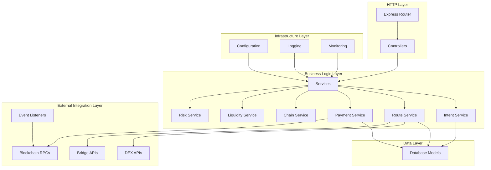

# Design Document: Griffin Orchestrator

## Overview

The Griffin Orchestrator is a TypeScript Express.js server that serves as the core backend service for cross-chain payment orchestration. It implements an intent-based architecture where users submit payment intents through the SDK, and the orchestrator handles the complex multi-chain execution behind the scenes.

The service acts as a sophisticated middleman that:
- Receives and validates payment intents from the Griffin SDK
- Finds optimal routes across DEXs and bridges for cross-chain payments
- Executes payments atomically while providing instant confirmation to users
- Manages service liquidity across multiple chains for instant settlements
- Monitors blockchain events to verify transaction completion
- Implements comprehensive risk management and security controls

The orchestrator enables the core Griffin value proposition: users can pay for services on one blockchain using tokens from a different blockchain, with the payment appearing instant while the service handles all cross-chain complexity.

## Architecture

The Griffin Orchestrator follows a layered MVC architecture with clear separation of concerns:



### Architectural Principles

1. **Intent-Based Processing**: All operations center around payment intents that capture user desires
2. **Atomic Operations**: Payments either complete fully or fail completely with proper rollback
3. **Liquidity Provider Model**: Service maintains reserves to provide instant payment confirmation
4. **Event-Driven Monitoring**: Blockchain events drive state transitions and verification
5. **Modular Services**: Each business domain is encapsulated in dedicated service classes
6. **External API Abstraction**: All external integrations are wrapped in service interfaces

## Components and Interfaces

### Core Service Components

#### Intent Service
Manages the lifecycle of payment intents from creation to completion.

```typescript
interface IntentService {
  createIntent(intentData: PaymentIntentRequest): Promise<PaymentIntent>
  validateIntent(intent: PaymentIntent): Promise<ValidationResult>
  updateIntentStatus(intentId: string, status: IntentStatus, metadata?: any): Promise<void>
  getIntent(intentId: string): Promise<PaymentIntent | null>
  getIntentsByStatus(status: IntentStatus): Promise<PaymentIntent[]>
}

interface PaymentIntent {
  id: string
  sourceChain: ChainId
  destinationChain: ChainId
  sourceToken: TokenAddress
  destinationToken: TokenAddress
  sourceAmount: BigNumber
  destinationAmount: BigNumber
  userAddress: Address
  destinationAddress: Address
  signature: string
  status: IntentStatus
  createdAt: Date
  updatedAt: Date
  executionMetadata?: ExecutionMetadata
}

enum IntentStatus {
  PENDING = 'pending',
  VALIDATED = 'validated',
  ROUTING = 'routing',
  EXECUTING = 'executing',
  COMPLETED = 'completed',
  FAILED = 'failed',
  EXPIRED = 'expired'
}
```

#### Route Service
Finds optimal paths for cross-chain payments by querying multiple DEXs and bridges.

```typescript
interface RouteService {
  findOptimalRoute(intent: PaymentIntent): Promise<PaymentRoute>
  getQuotes(request: QuoteRequest): Promise<Quote[]>
  validateRoute(route: PaymentRoute): Promise<boolean>
  estimateExecutionTime(route: PaymentRoute): Promise<number>
}

interface PaymentRoute {
  id: string
  steps: RouteStep[]
  totalCost: BigNumber
  estimatedTime: number
  slippageTolerance: number
  confidence: number
}

interface RouteStep {
  type: 'swap' | 'bridge' | 'transfer'
  protocol: string
  sourceChain: ChainId
  destinationChain: ChainId
  sourceToken: TokenAddress
  destinationToken: TokenAddress
  amount: BigNumber
  estimatedGas: BigNumber
  calldata?: string
}
```

#### Payment Service
Executes payment routes and coordinates cross-chain operations.

```typescript
interface PaymentService {
  executePayment(intent: PaymentIntent, route: PaymentRoute): Promise<ExecutionResult>
  executeStep(step: RouteStep): Promise<StepResult>
  handleInstantPayment(intent: PaymentIntent): Promise<void>
  reconcileSettlement(bridgeTransfer: BridgeTransfer): Promise<void>
}

interface ExecutionResult {
  success: boolean
  transactionHashes: string[]
  error?: string
  gasUsed: BigNumber
  actualSlippage: number
}
```

#### Chain Service
Manages connections and operations across multiple blockchain networks.

```typescript
interface ChainService {
  getProvider(chainId: ChainId): Provider
  submitTransaction(chainId: ChainId, transaction: Transaction): Promise<string>
  getTransactionReceipt(chainId: ChainId, hash: string): Promise<TransactionReceipt | null>
  estimateGas(chainId: ChainId, transaction: Transaction): Promise<BigNumber>
  getCurrentGasPrice(chainId: ChainId): Promise<BigNumber>
  getBlockNumber(chainId: ChainId): Promise<number>
}

interface ChainConfig {
  chainId: ChainId
  name: string
  rpcUrl: string
  wsUrl?: string
  explorerUrl: string
  nativeCurrency: Currency
  gasMultiplier: number
  confirmationBlocks: number
}
```

#### Liquidity Service
Manages service reserves and liquidity across multiple chains.

```typescript
interface LiquidityService {
  getAvailableLiquidity(chainId: ChainId, token: TokenAddress): Promise<BigNumber>
  checkLiquidityRequirement(intent: PaymentIntent): Promise<boolean>
  reserveLiquidity(intent: PaymentIntent): Promise<void>
  releaseLiquidity(intentId: string): Promise<void>
  rebalanceLiquidity(fromChain: ChainId, toChain: ChainId, token: TokenAddress, amount: BigNumber): Promise<void>
  getLiquidityStatus(): Promise<LiquidityStatus[]>
}

interface LiquidityStatus {
  chainId: ChainId
  token: TokenAddress
  available: BigNumber
  reserved: BigNumber
  threshold: BigNumber
  needsRebalancing: boolean
}
```

#### Risk Service
Implements security controls and risk management.

```typescript
interface RiskService {
  validateTransaction(intent: PaymentIntent): Promise<RiskAssessment>
  checkSlippageProtection(route: PaymentRoute, currentPrices: PriceData[]): Promise<boolean>
  isAddressBlacklisted(address: Address): Promise<boolean>
  checkTransactionLimits(intent: PaymentIntent, userAddress: Address): Promise<boolean>
  assessMarketVolatility(tokens: TokenAddress[]): Promise<VolatilityAssessment>
}

interface RiskAssessment {
  approved: boolean
  riskScore: number
  flags: RiskFlag[]
  requiredActions: string[]
}
```

### HTTP Controllers

#### Intent Controller
Handles payment intent lifecycle endpoints.

```typescript
class IntentController {
  async createIntent(req: Request, res: Response): Promise<void>
  async getIntent(req: Request, res: Response): Promise<void>
  async getIntentStatus(req: Request, res: Response): Promise<void>
  async cancelIntent(req: Request, res: Response): Promise<void>
}
```

#### Quote Controller
Provides routing and pricing information.

```typescript
class QuoteController {
  async getQuote(req: Request, res: Response): Promise<void>
  async getRoutes(req: Request, res: Response): Promise<void>
  async validateRoute(req: Request, res: Response): Promise<void>
}
```

#### Health Controller
Provides service health and monitoring endpoints.

```typescript
class HealthController {
  async getHealth(req: Request, res: Response): Promise<void>
  async getLiquidityStatus(req: Request, res: Response): Promise<void>
  async getChainStatus(req: Request, res: Response): Promise<void>
}
```

### Event Listeners

#### Blockchain Event Monitor
Monitors blockchain events for transaction verification and state updates.

```typescript
interface EventListener {
  startListening(): Promise<void>
  stopListening(): Promise<void>
  subscribeToContract(chainId: ChainId, address: Address, events: string[]): Promise<void>
  handleEvent(event: BlockchainEvent): Promise<void>
}

interface BlockchainEvent {
  chainId: ChainId
  blockNumber: number
  transactionHash: string
  contractAddress: Address
  eventName: string
  args: any[]
  timestamp: Date
}
```

## Data Models

### Database Schema

The orchestrator uses a relational database to store payment intents, execution history, and operational data.

#### Payment Intents Table
```sql
CREATE TABLE payment_intents (
  id UUID PRIMARY KEY,
  source_chain INTEGER NOT NULL,
  destination_chain INTEGER NOT NULL,
  source_token VARCHAR(42) NOT NULL,
  destination_token VARCHAR(42) NOT NULL,
  source_amount DECIMAL(78,0) NOT NULL,
  destination_amount DECIMAL(78,0) NOT NULL,
  user_address VARCHAR(42) NOT NULL,
  destination_address VARCHAR(42) NOT NULL,
  signature TEXT NOT NULL,
  status VARCHAR(20) NOT NULL,
  route_data JSONB,
  execution_metadata JSONB,
  created_at TIMESTAMP DEFAULT NOW(),
  updated_at TIMESTAMP DEFAULT NOW()
);
```

#### Execution History Table
```sql
CREATE TABLE execution_history (
  id UUID PRIMARY KEY,
  intent_id UUID REFERENCES payment_intents(id),
  step_index INTEGER NOT NULL,
  step_type VARCHAR(20) NOT NULL,
  protocol VARCHAR(50) NOT NULL,
  transaction_hash VARCHAR(66),
  status VARCHAR(20) NOT NULL,
  gas_used DECIMAL(78,0),
  error_message TEXT,
  created_at TIMESTAMP DEFAULT NOW()
);
```

#### Liquidity Reserves Table
```sql
CREATE TABLE liquidity_reserves (
  id UUID PRIMARY KEY,
  chain_id INTEGER NOT NULL,
  token_address VARCHAR(42) NOT NULL,
  available_balance DECIMAL(78,0) NOT NULL,
  reserved_balance DECIMAL(78,0) NOT NULL,
  threshold_balance DECIMAL(78,0) NOT NULL,
  last_updated TIMESTAMP DEFAULT NOW(),
  UNIQUE(chain_id, token_address)
);
```

### TypeScript Models

```typescript
// Database entity models using TypeORM or similar
@Entity('payment_intents')
export class PaymentIntentEntity {
  @PrimaryGeneratedColumn('uuid')
  id: string

  @Column('integer')
  sourceChain: number

  @Column('integer')
  destinationChain: number

  @Column('varchar', { length: 42 })
  sourceToken: string

  @Column('varchar', { length: 42 })
  destinationToken: string

  @Column('decimal', { precision: 78, scale: 0 })
  sourceAmount: string

  @Column('decimal', { precision: 78, scale: 0 })
  destinationAmount: string

  @Column('varchar', { length: 42 })
  userAddress: string

  @Column('varchar', { length: 42 })
  destinationAddress: string

  @Column('text')
  signature: string

  @Column('varchar', { length: 20 })
  status: IntentStatus

  @Column('jsonb', { nullable: true })
  routeData?: any

  @Column('jsonb', { nullable: true })
  executionMetadata?: any

  @CreateDateColumn()
  createdAt: Date

  @UpdateDateColumn()
  updatedAt: Date
}
```